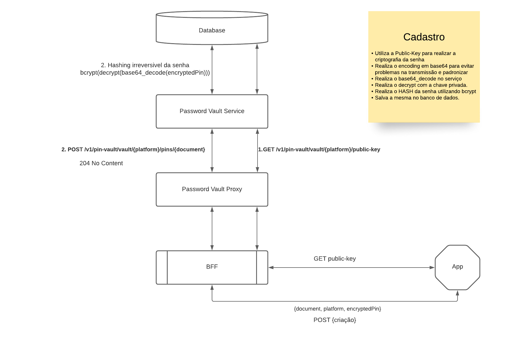
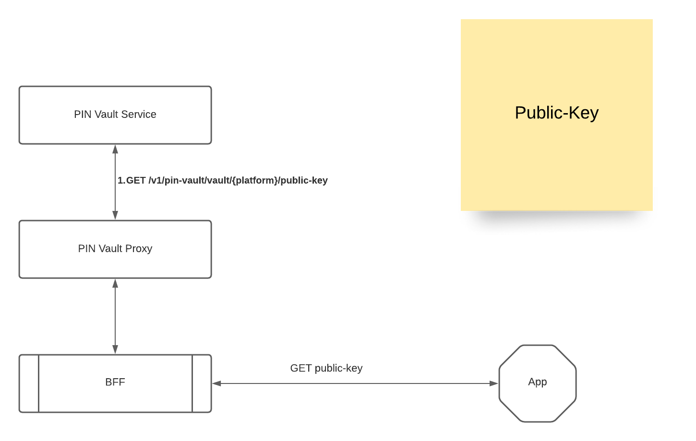
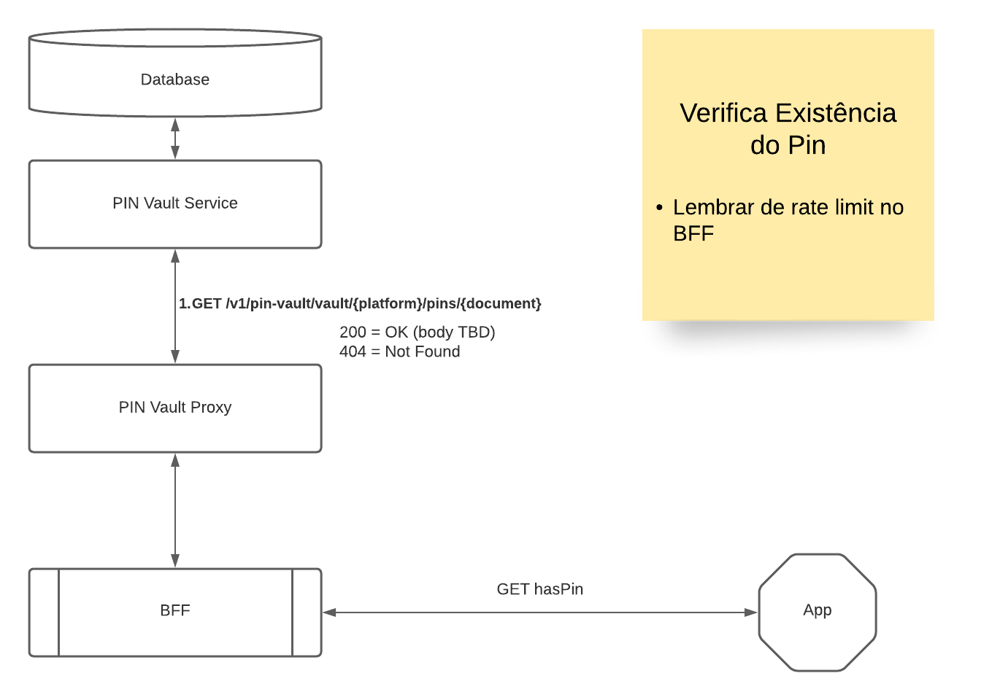
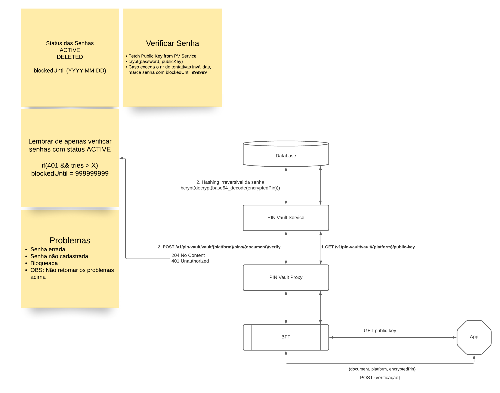
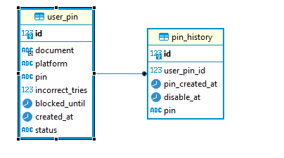
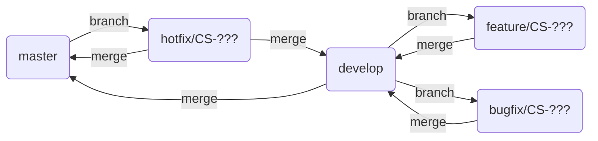

# PIN Vault Service

## Table of contents
- [Pin Vault Service](#pin-vault-service)
  - [Table of contents](#table-of-contents)
  - [1 - Features](#1---features)
  - [2 - Documentation](#2---documentation)
  - [3 - Stack](#3---stack)
    - [3.1 - Environments](#31---environments)
    - [3.2 - Runtime and Compilation](#32---runtime-and-compilation)
    - [3.3 - Deployment](#33---deployment)
    - [3.4 - Database](#34---database)
    - [3.5 - ER Diagram](#35---er-diagram)
  - [4 - Development](#4---development)
    - [4.1 - Guidelines](#41---guidelines)
    - [4.2 - Branch Strategy](#42---branch-strategy)
  - [5 - Usage](#5---usage)
    - [5.1 - Useful Tasks](#51---useful-tasks)
  - [6 - Changelog](#6---changelog)
  - [7 - Maintainer](#7---maintainer)
  - [8 - Wiki](#8---wiki)
---

## [1 - Features](#table-of-contents) 

* Entry point for setting a new PIN for a certain user for its later verification


* Entry point for retrieving public-key for the pin-vault service


* Entry point for verifying if a PIN already exists


* Entry point for verify if the password is correct


## [2 - Documentation](#table-of-contents)

Type          | Link
------------- | :-----------: 
OpenAPI       | [View](docs/swagger.yml)       
---

## [3 - Stack](#table-of-contents)

### [3.1 - Environments](#table-of-contents)
Environment | Base URL
----------- | --------
Local       | http://localhost:8080/
Development | 
Production  | 

### [3.2 - Runtime and Compilation](#table-of-contents)

Artifacts | Version
--------- | :-----------:
Gradle    | 6.6.1
Java JDK  | 11.0.7

### [3.3 - Deployment](#table-of-contents)

Tool      | Version       | Notes
--------- | :-----------: | --------------------------
APM       | 1.17.0        | 
Docker    |               | View [Dockerfile](Dockerfile).

### [3.4 - Database](#table-of-contents)

DBMS             | Version       | Notes
---------------- | :-----------: | --------------------------
MySQL            | 8.0           | Schema name: 'pin-vault'

---

### [3.5 - ER Diagram](#table-of-contents)


---

## [4 - Development](#table-of-contents)

Artifacts          | Version       | Notes
------------------ | :-----------: | --------------------------
Spring Boot        | 2.4.5 |
JUnit              | 5             |
JaCoCo             | 0.8.5         | Must be added as a Gradle plugin.
Lombok             | 1.18.20       | Must be added as an IDE plugin.

### [4.1 - Guidelines](#table-of-contents)

- Apply DDD ([Domain Driven Design](https://martinfowler.com/bliki/DomainDrivenDesign.html))
- Develop unit tests using JUnit 5
- Exclude common classes from the JaCoCo coverage (utils, entities, etc)
- Keep code coverage above 90%
- Create API documentation using [OpenAPI](https://swagger.io/specification/)
- Create message broker documentation using [AsyncAPI](https://www.asyncapi.com/docs/specifications/2.0.0)

### [4.2 - Branch Strategy](#table-of-contents)
* *master* (Production branch)
  Code coming from development branch merge requests and hotfix branches. Not allowed to push commits directly into this branch.
* *develop* (Development branch) 
  Code previously accepted in feature merge requests, bugfixes and hotfixes as well. Not allowed to push commits directly into this branch.



---

## [5 - Usage](#table-of-contents)

### [5.1 - Useful Tasks](#table-of-contents)

Clean and build the project:
```
gradle clean build
```

Test the project:
```
gradle test
```

Generates the test coverage report:
```
gradle jacocoTestReport
```

Run application:
```
gradle bootRun
```

---

## [6 - Changelog](#table-of-contents)

You can check the project changelog [here](CHANGELOG.md).

---

## [7 - Maintainer](#table-of-contents)

- [phi](https://somosphi.com.br) - ID Services Team
- [team](https://wiki.dev.phipagamentos.com/pt-br/Equipes/Identity/home) - ID Services Team

## [8 - Wiki](#table-of-contents)

- [wiki](https://wiki.dev.phipagamentos.com/Produtos/Auth/Pin-Vault) - Pin Vault
